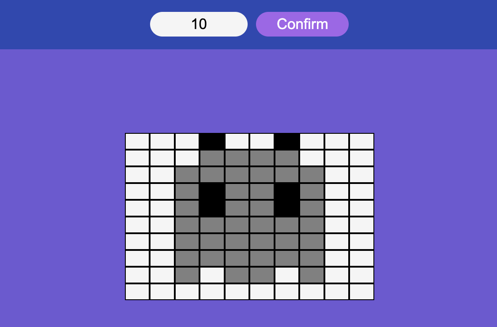

# Draw-Art

Draw-Art est une application JavaScript conçue pour créer une ardoise de dessin en pixel art.

## Description

Ce projet vise à créer une ardoise de dessin en pixel art. Initialement, une grille de 8x8 cases est générée. Les utilisateurs peuvent interagir avec les pixels en cliquant dessus pour changer leur couleur. De plus, un formulaire est ajouté pour permettre à l'utilisateur de redimensionner la grille en spécifiant la taille souhaitée.

## Fonctionnalités

- **Génération de la grille :** Création d'une grille de 8x8 cases.
- **Interaction avec les pixels :** Cliquer sur un pixel pour changer sa couleur.
- **Formulaire de configuration :** Permet à l'utilisateur de redimensionner la grille en saisissant une nouvelle taille.

## Comment Utiliser

1. **Génération de la Grille :** Ouvrez l'application pour afficher la grille de départ.
2. **Interaction avec les Pixels :** Cliquez sur un pixel pour alterner sa couleur entre noir et gris.
3. **Formulaire de Configuration :** Utilisez le formulaire pour spécifier une nouvelle taille de grille, puis soumettez-le pour afficher la grille redimensionnée.

## Contributeur

Alexandre Klein a développé ce projet.
